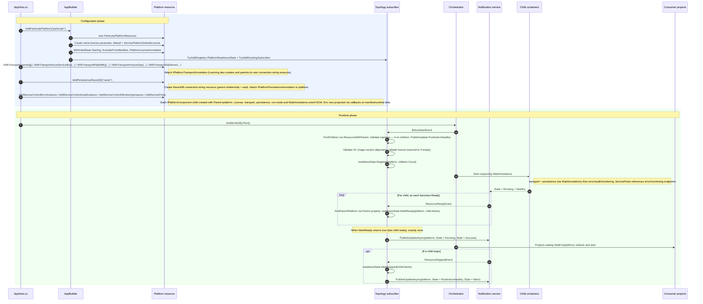

# Particular.Aspire.ServicePlatform — Platform Design

How `AddParticularPlatform(...)` works end-to-end, from the fluent API call in `AppHost.cs` through configuration, orchestrator startup, and child-readiness propagation to the `Running` state.

## Resource topology

```mermaid
graph TB
    Platform[ParticularPlatformResource<br/><i>synthetic, ExcludeFromManifest</i>]
    Transport[Transport<br/><i>connection string resource</i>]
    Raven[RavenDbPlatformPersistenceResource<br/><i>IResourceWithConnectionString</i>]
    Error[ServiceControlErrorInstanceResource]
    Audit[ServiceControlAuditInstanceResource]
    Monitoring[ServiceControlMonitoringInstanceResource]
    SP[ServicePulseResource]

    Platform -. transport annotation .-> Transport
    Platform -. WithParentRelationship + wait .-> Raven
    Platform ==> Error
    Platform ==> Audit
    Platform ==> Monitoring
    Platform ==> SP

    Platform -.- A1["IPlatformTransportAnnotation\n(Learning / AzureServiceBus /\nRabbitMq / AmazonSqs)"]
    Platform -.- A2[IPlatformPersistenceAnnotation]
    Platform -.- A3[PlatformLicenseAnnotation]

    classDef annotation fill:#fff3cd,stroke:#d4a600,stroke-dasharray: 3 3,color:#333
    classDef external fill:#e8e8e8,stroke:#888,stroke-dasharray: 5 5,color:#333
    classDef synthetic fill:#cfe2ff,stroke:#0d6efd,color:#333
    class A1,A2,A3 annotation
    class Transport external
    class Platform synthetic
```

The synthetic parent [`ParticularPlatformResource`](https://github.com/Particular/Particular.Aspire.Hosting.ServicePlatform/blob/main/src/Particular.Aspire.Hosting.ServicePlatform/Platform/ParticularPlatformResource.cs) holds no child references — the subscriber discovers children at runtime via `IResourceWithParent<ParticularPlatformResource>`. Transport is an external (consumer-supplied or platform-created) resource attached by annotation. Persistence (RavenDB, in the current implementation) is a connection-string resource attached to the platform by a `IPlatformPersistenceAnnotation`. ServiceControl and ServicePulse resources are attached as children and discovered by their concrete resource type.



Legend: `==>` = readiness child (`IResourceWithParent<T>` + `IPlatformComponent`, counted by `PlatformReadinessState`), `-.->` = supporting resource not counted toward readiness (transport and persistence), dashed boxes = annotations carrying config data.

Transport and persistence are wait dependencies of the ServiceControl instances, **not** readiness children: the platform reaches `Running` based only on its `IPlatformComponent` children (error, audit, monitoring, ServicePulse).

## Discovery patterns

At `BeforeStartEvent`, the `PlatformTopologyEventingSubscriber` discovers all child resources of the platform via `IResourceWithParent<ParticularPlatformResource>`, then runs four steps:

1. **Validate topology:** if no children are present, publishes `RuntimeUnhealthy` (Error style) on the platform.
2. **Validate container image version alignment:** if the ServiceControl error/audit/monitoring instances have mismatched container image tags, logs a warning.
3. **Validate license:** resolves the license parameter; if it is empty, logs a warning listing the search paths (or an error if no default search path exists).
4. **Register child count** in `PlatformReadinessState`.

At `ResourceReadyEvent`, the subscriber finds the parent platform via the child's `Parent` property and calls `readinessState.MarkReady(platform, child.Name)`. When the last child becomes ready (and the expected count is greater than zero), the platform state changes to `Running` exactly once.

At `ResourceStoppedEvent`, if a platform child stops, the platform's state changes to `RuntimeUnhealthy`.

> See [Aspire Custom Integration Guide — Resource type design](aspire-integration-guide.md#resource-type-design) and [Synthetic parent resources](aspire-integration-guide.md#synthetic-parent-resources) for best practices on keeping resource classes and annotation shapes minimal, and for the rationale behind synthetic grouping nodes like `ParticularPlatformResource`.

### Annotations — for external references

Used for: [`IPlatformTransportAnnotation`](https://github.com/Particular/Particular.Aspire.Hosting.ServicePlatform/blob/main/src/Particular.Aspire.Hosting.ServicePlatform/Transport/IPlatformTransportAnnotation.cs), [`PlatformLicenseAnnotation`](https://github.com/Particular/Particular.Aspire.Hosting.ServicePlatform/blob/main/src/Particular.Aspire.Hosting.ServicePlatform/Licensing/PlatformLicenseAnnotation.cs), [`IPlatformPersistenceAnnotation`](https://github.com/Particular/Particular.Aspire.Hosting.ServicePlatform/blob/main/src/Particular.Aspire.Hosting.ServicePlatform/Persistence/IPlatformPersistenceAnnotation.cs).

Annotations attached to the platform resource hold references to configuration or resources that exist outside the readiness-child tree:

- **Transport** — consumer-supplied (such as `builder.AddAzureServiceBus(...)`) or platform-created (Learning transport creates its own connection-string resource). The integration doesn't own or extend those resource types; instead, a new annotation type is authored per transport. All transport annotations implement `IPlatformTransportAnnotation`; `WithTransportFrom(platform)` invokes `ApplyTo(...)` to project `TRANSPORTTYPE` + `CONNECTIONSTRING` onto platform components (Azure Service Bus and RabbitMQ share the `PlatformTransportAnnotation` base). Each annotation should stay minimal — only fields intrinsic to the transport itself. Configuration that describes how a *specific component* uses the transport (e.g., the SC error instance's throughput-reporting credentials for ASB) belongs on the component as an opt-in extension, not on the transport annotation. See [Opt-in extensions on child resources](#opt-in-extensions-on-child-resources) below.
- **License parameter** — a plain `ParameterResource` named `{platform-name}-license` (secret), created in `AddParticularPlatform` and held in `PlatformLicenseAnnotation`. Its `Default` value has an auto-discovery search path (see [License configuration](#license-configuration)).
- **Persistence reference** — `IPlatformPersistenceAnnotation` is attached by `WithPersistenceRavenDb(...)` (and, transitively, `AddPersistenceRavenDb(...)`) to record which persistence resource the platform uses. The annotation holds a reference to the persistence `IResource` and an `ApplyConfig(EnvironmentCallbackContext)` method that projects the persistence env vars onto a consuming component.

> **Key Design:** When supporting a new transport (or persistence) integration, **do not subclass or extend existing annotation/resource types**. Instead, create a new annotation class for the integration, with any additional fields needed. This ensures configuration boundaries and extensibility, without growing or tightly coupling the platform's core annotations.

> See [Anti-patterns to avoid](aspire-integration-guide.md#anti-patterns-to-avoid) and [Mental model](aspire-integration-guide.md#mental-model) in the Aspire Custom Integration Guide for a full list of architectural anti-patterns (including annotation misuse) and the reasoning behind treating resources as a discriminated union of annotations.

### Typed children — for platform-owned resources with fixed identity

Used for: [`ServiceControlErrorInstanceResource`](https://github.com/Particular/Particular.Aspire.Hosting.ServicePlatform/blob/main/src/Particular.Aspire.Hosting.ServicePlatform/Platform/ServiceControlErrorInstanceResource.cs), [`ServiceControlAuditInstanceResource`](https://github.com/Particular/Particular.Aspire.Hosting.ServicePlatform/blob/main/src/Particular.Aspire.Hosting.ServicePlatform/Platform/ServiceControlAuditInstanceResource.cs), [`ServiceControlMonitoringInstanceResource`](https://github.com/Particular/Particular.Aspire.Hosting.ServicePlatform/blob/main/src/Particular.Aspire.Hosting.ServicePlatform/Platform/ServiceControlMonitoringInstanceResource.cs), [`ServicePulseResource`](https://github.com/Particular/Particular.Aspire.Hosting.ServicePlatform/blob/main/src/Particular.Aspire.Hosting.ServicePlatform/Platform/ServicePulseResource.cs).

Each of these is owned by the platform and has a single, fixed role. All implement [`IPlatformComponent`](https://github.com/Particular/Particular.Aspire.Hosting.ServicePlatform/blob/main/src/Particular.Aspire.Hosting.ServicePlatform/Platform/IPlatformComponent.cs) and `IResourceWithParent<ParticularPlatformResource>`. The subscriber finds them by class type, e.g.:

```csharp
var errorInstance = children.OfType<ServiceControlErrorInstanceResource>().SingleOrDefault();
```

No annotation is needed — the concrete type *is* the identity. `IResourceWithParent<ParticularPlatformResource>` on each resource supplies both the discovery path and the readiness coupling.

### Marker annotation — for platform-owned persistence with multiple implementations

Used for: [`IPlatformPersistenceAnnotation`](https://github.com/Particular/Particular.Aspire.Hosting.ServicePlatform/blob/main/src/Particular.Aspire.Hosting.ServicePlatform/Persistence/IPlatformPersistenceAnnotation.cs) (currently implemented by `RavenDbPlatformPersistenceAnnotation`; e.g., future SQL Server).

Persistence is **not** modelled as a typed readiness child. The persistence resource itself (`RavenDbPlatformPersistenceResource`) is an ordinary `ContainerResource, IResourceWithConnectionString`. The link to the platform is carried by an annotation attached to the platform, which also knows how to project its env vars onto a consuming component:

```csharp
interface IPlatformPersistenceAnnotation : IResourceAnnotation {
    IResource Resource { get; }                       // the persistence resource
    void ApplyConfig(EnvironmentCallbackContext context);  // projects e.g. RAVENDB_CONNECTIONSTRING
}
```

A ServiceControl instance receives persistence in two steps:

1. The component's `WithPersistence(persistence)` extension validates that `persistence` is a registered platform persistence (via `ParticularPlatformResource.TryGetPersistenceConfig`), then attaches a `WaitAnnotation` (`WaitUntilHealthy`), a dashboard relationship, and a copy of the matching `IPlatformPersistenceAnnotation`.
2. At env-var projection time the error/audit instance reads its `IPlatformPersistenceAnnotation` and calls `ApplyConfig(context)`. If no persistence annotation is present, it throws.

When adding a new persistence implementation (e.g., SQL Server):

- Create a new resource type (e.g., `SqlPlatformPersistenceResource`) — an ordinary connection-string resource.
- Create a new annotation type (e.g., `SqlServerPlatformPersistenceAnnotation`) implementing `IPlatformPersistenceAnnotation`, projecting that backend's env vars from `ApplyConfig`; **do not extend existing annotations**.
- Expose `AddPersistenceSqlServer(...)` / `WithPersistenceSqlServer(...)` extensions that attach the annotation.

### Additional annotations on child resources

- [`RemoteInstanceAnnotation`](https://github.com/Particular/Particular.Aspire.Hosting.ServicePlatform/blob/main/src/Particular.Aspire.Hosting.ServicePlatform/Platform/RemoteInstanceAnnotation.cs) — lets error instances point to remote audit. Holds a `ReferenceExpression` (`Endpoint`); the error instance projects all of them into `REMOTEINSTANCES` as a JSON array of `{"api_uri": "..."}` entries.
- [`ThroughputQueueAnnotation`](https://github.com/Particular/Particular.Aspire.Hosting.ServicePlatform/blob/main/src/Particular.Aspire.Hosting.ServicePlatform/Platform/ThroughputQueueAnnotation.cs) — carries the usage queue name between error/monitoring.
- [`ThroughputReportingAnnotation`](https://github.com/Particular/Particular.Aspire.Hosting.ServicePlatform/blob/main/src/Particular.Aspire.Hosting.ServicePlatform/ThroughputReporting/ThroughputReportingAnnotation.cs) — marker annotation attached to an error instance if throughput reporting requires extra configuration. Records the `IThroughputReportingProvider` that supplied the configuration so validators/publish hooks/tests can introspect the wire-up. The provider itself projects the env vars (see [Opt-in extensions](#opt-in-extensions-on-child-resources)).
- [`RunModeAnnotation`](https://github.com/Particular/Particular.Aspire.Hosting.ServicePlatform/blob/main/src/Particular.Aspire.Hosting.ServicePlatform/Platform/RunModeAnnotation.cs) — carries the `PlatformRunMode` for a ServiceControl instance (see [Run modes](#run-modes)).

### Opt-in extensions on child resources

Some component configuration is genuinely optional (the user opts in by chaining a `With...` method on the child builder). The convention follows three pieces:

1. **A data-carrying or marker annotation.** Some opt-ins own their value directly (e.g., `ThroughputQueueAnnotation` holds the queue name). Pluggable opt-ins use a thin marker that carries a provider instance (e.g., `ThroughputReportingAnnotation` holds an `IThroughputReportingProvider`); the provider owns the values and the env vars are the projection.
2. **Centralised `const string` env-var names** in the [`PlatformEnvironment`](https://github.com/Particular/Particular.Aspire.Hosting.ServicePlatform/blob/main/src/Particular.Aspire.Hosting.ServicePlatform/PlatformEnvironment.cs) static class (e.g., `PlatformEnvironment.ServiceControl.LicensingComponent.ServiceControlThroughputDataQueue`, `PlatformEnvironment.ServiceControl.LicensingComponent.AzureServiceBus.ServiceBusName`). Each env-var contract lives in one place, organised by the component/transport that consumes it.
3. **An extension method** on `IResourceBuilder<TComponent>` in the appropriate `…Extensions.cs` file (e.g., `ErrorInstanceExtensions.WithThroughputReporting`). For pluggable opt-ins like throughput reporting it accepts a provider interface (`IThroughputReportingProvider`); `WithThroughputReporting` calls `provider.ApplyTo(errorInstance)` (which validates inputs — e.g. that the platform transport matches the provider — and projects the env vars), then attaches the marker annotation so the wire-up is introspectable.

This shape lets cross-resource consumers read the values back via `TryGetLastAnnotation<T>(...)`. For example, `MonitoringInstanceExtensions.WithThroughputQueueFrom(errorInstance)` reads `ThroughputQueueAnnotation` off the error instance to copy the queue name onto monitoring without forcing the caller to repeat it. New opt-in extensions should mirror the pattern so the same consumer-side reuse stays available.

### Run modes

Each ServiceControl instance (error, audit, monitoring) supports a [`PlatformRunMode`](https://github.com/Particular/Particular.Aspire.Hosting.ServicePlatform/blob/main/src/Particular.Aspire.Hosting.ServicePlatform/Platform/PlatformRunMode.cs) set via `WithRunMode(...)`, stored in a `RunModeAnnotation` and projected to a container argument by `WithRunModeArgs()`: `SetupAndRun` (default) → `--setup-and-run`, `Setup` → `--setup`, `Run` → no argument.

### Adding new transports or persistence types

**Do not extend or subclass base platform annotation/resource types for new integrations.**

Instead, follow this process:

1. Create a new annotation type (e.g., `FooTransportAnnotation` implementing `IPlatformTransportAnnotation`, or `BarPersistenceAnnotation` implementing `IPlatformPersistenceAnnotation`) for the new integration, including any extra configuration required by that transport or persistence provider. Attach with `.WithAnnotation(...)`.
2. If a new resource is needed, define a new resource type (an ordinary `IResourceWithConnectionString` for persistence; transport resources are typically consumer-supplied).
3. Connect with `WithParentRelationship`/`WithRelationship` and annotate, without altering base classes.
4. Consumers discover all platform integrations by reading the attached annotation types for transport and persistence; new annotations are automatically discovered if they implement the correct marker interfaces.

**Each integration remains isolated, versionable, and avoids breaking existing integrations.**

## Lifecycle sequence



## Key invariants

- **Platform resource has no mutable state.** Config lives on annotations (`IPlatformTransportAnnotation`, `PlatformLicenseAnnotation`, `IPlatformPersistenceAnnotation`) attached at configuration time.
- **No subclassing of base platform annotation/resource types for extensions.** New transport/persistence integrations are added with new annotation types containing only the relevant fields.
- **Cross-wiring happens at configuration time, order-independently.** `With*` fluent methods attach annotations and register callbacks carrying `ReferenceExpression`s rather than resolved values, so the declaration order of resources doesn't matter — endpoints, connection strings, persistence config, and run-mode args are resolved when env vars/args are projected at manifest/runtime time. See [Late-bound cross-wiring](#late-bound-cross-wiring).
- **Platform readiness ↔ all `IPlatformComponent` children ready.** Readiness tracked by [`PlatformReadinessState`](https://github.com/Particular/Particular.Aspire.Hosting.ServicePlatform/blob/main/src/Particular.Aspire.Hosting.ServicePlatform/Platform/PlatformReadinessState.cs). Transport and persistence are wait dependencies, not readiness children.
- **Missing transport is detected when first consumed.** `ParticularPlatformResource.GetTransport()` throws if no transport annotation is present.
- **Missing persistence is detected when first consumed.** A ServiceControl instance throws at env-var projection time if it has no `IPlatformPersistenceAnnotation`.
- **No children → unhealthy state.** Marked `RuntimeUnhealthy` by the eventing subscriber at runtime.
- **Children die with platform.** Lifecycle coupling via `IResourceWithParent<ParticularPlatformResource>`.

> For broader Aspire integration principles — project layout, naming conventions, lifecycle patterns, and connection string design — consult the [Aspire Custom Integration Guide](aspire-integration-guide.md).

## Extension API usage example

```csharp
// AppHost.cs
var transport = builder.AddAzureServiceBus("transport"); // or AddConnectionString / AddRabbitMQ / etc.

var platform = builder.AddParticularPlatform("platform")
    .WithTransportAzureServiceBus(transport); // or .WithTransportLearning()
                                              //    .WithTransportRabbitMQ(RabbitMqRouting.QuorumConventionalRouting, rabbit)
                                              //    .WithTransportAmazonSqs("us-east-1", accessKey, secretKey)

var persistence = platform.AddPersistenceRavenDb("ravendb");

var tenantId       = builder.AddParameter("asb-tenant-id");
var subscriptionId = builder.AddParameter("asb-subscription-id");
var clientId       = builder.AddParameter("asb-client-id");
var clientSecret   = builder.AddParameter("asb-client-secret", secret: true);

var error = platform.AddServiceControlErrorInstance("servicecontrol", persistence)
    .WithThroughputQueue("particular.throughput")
    .WithThroughputReporting(new ThroughputReportingAzureServiceBus(  // opt-in: SC reports ASB throughput
        tenantId.Resource,
        subscriptionId.Resource,
        clientId.Resource,
        clientSecret.Resource));                                      // serviceBusName + managementUrl optional

// Implicitly wires error → audit: AddServiceControlAuditInstance internally calls
// error.WithRemoteInstance(audit), attaching a RemoteInstanceAnnotation whose
// ReferenceExpression resolves at manifest/runtime time. See "Late-bound cross-wiring" below.
var audit = platform.AddServiceControlAuditInstance("servicecontrol-audit", error, persistence);
var monitoring = platform.AddServiceControlMonitoringInstance("servicecontrol-monitoring")
    .WithThroughputQueueFrom(error);                   // copies the throughput queue name from error
platform.AddServicePulse("servicepulse", error, monitoring);

// Optionally inject license + transport into a consumer project:
builder.AddProject<Projects.MyWorker>("worker")
    .WithParticularPlatform(platform);
```

The matching providers for the other transports are `ThroughputReportingRabbitMq(apiUrl?, userName?, password?)`, `ThroughputReportingAmazonSqs(accessKey?, secretKey?, profile?, region?, prefix?)`, and `ThroughputReportingSqlServer(connectionString?, additionalCatalogs?)`.

### Late-bound cross-wiring

The example above hides one piece of wiring: `error` is declared before `audit`, yet `REMOTEINSTANCES` on the error instance must point at the audit endpoint. This works because cross-wiring is captured as a deferred expression, not a value:

1. `AddServiceControlAuditInstance(name, error, persistence)` constructs the audit resource and, as a side effect, calls `error.WithRemoteInstance(audit)`. This is what makes the `error` parameter meaningful.
2. `WithRemoteInstance` attaches a `RemoteInstanceAnnotation` to the error instance, holding a `ReferenceExpression` over `audit.GetEndpoint(ServiceControlAuditInstanceResource.HttpEndpointName)`. No URL is resolved at this point.
3. `ServiceControlErrorInstanceResource` registers an env-var callback that, at manifest generation and at orchestrator startup, reads all `RemoteInstanceAnnotation`s off itself and projects `REMOTEINSTANCES` (a JSON array of `{"api_uri": "..."}`) from the now-resolvable `ReferenceExpression`s.

The same pattern is used for any cross-resource env var whose right-hand side is an endpoint or connection string from another resource (e.g. ServicePulse's `SERVICECONTROL_URL` and `MONITORING_URL`, or the persistence `RAVENDB_CONNECTIONSTRING` applied via `IPlatformPersistenceAnnotation.ApplyConfig`). This is why declaration order is irrelevant: the only thing the configuration phase needs is the builder reference, not the resolved endpoint.

### License configuration

License configuration options (all on `IResourceBuilder<ParticularPlatformResource>`):

- `.WithLicenseFromFile("license.xml")` — sets the license parameter default to read from a specific file path (`ServicePlatformFileLicense`).
- `.WithLicenseFromText(licenseXml)` — sets the default to inline license XML (`ServicePlatformTextLicense`).
- Default (`ServicePlatformDefaultLicense`): auto-discovers, in order, from:
  1. `license.xml` next to the AppHost binary (`AppDomain.CurrentDomain.BaseDirectory`),
  2. `%LOCALAPPDATA%/ParticularSoftware/license.xml`,
  3. `%PROGRAMDATA%/ParticularSoftware/license.xml` (CommonApplicationData),
  4. the `PARTICULARSOFTWARE_LICENSE` environment variable,
  5. a built-in `"Trial"` license. This final source always resolves, so the default license is never empty — the license-validation warning applies when a `WithLicenseFrom*` override resolves to nothing or the license is `Trial`.

## Env vars applied to each child

Env-var callbacks are registered at configuration time but evaluated when the manifest is generated / the orchestrator starts (see [Late-bound cross-wiring](#late-bound-cross-wiring)).

| Target       | License                        | Transport                              | Persistence                  | Remote instances              | ServicePulse URLs                                             |
| ------------ | ------------------------------ | -------------------------------------- | ---------------------------- | ----------------------------- | ------------------------------------------------------------- |
| Error        | ✅ `PARTICULARSOFTWARE_LICENSE` | ✅ `TRANSPORTTYPE` + `CONNECTIONSTRING` | ✅ `RAVENDB_CONNECTIONSTRING` | ✅ `REMOTEINSTANCES` (→ audit) | —                                                             |
| Audit        | ✅                              | ✅                                      | ✅                            | —                             | —                                                             |
| Monitoring   | ✅                              | ✅                                      | —                            | —                             | —                                                             |
| ServicePulse | ✅                              | —                                      | —                            | —                             | ✅ `SERVICECONTROL_URL` (→ error) + `MONITORING_URL` (→ monitoring, or `"!"` when no monitoring) |
| RavenDB      | —                              | —                                      | —                            | —                             | —                                                             |

Queue-name env vars (always applied with defaults; overridable):

- Error → `SERVICEBUS_ERRORQUEUE` via `WithErrorQueueName(name)` (default `error`).
- Audit → `SERVICEBUS_AUDITQUEUE` via `WithAuditQueueName(name)` (default `audit`).
- Monitoring → `MONITORING_INSTANCENAME` via `WithMonitoringQueueName(name)`.

The Error instance can additionally receive opt-in env vars from caller-chained extensions:

- `WithThroughputQueue(name)` → `LICENSINGCOMPONENT_SERVICECONTROLTHROUGHPUTDATAQUEUE`
- `WithThroughputReporting(new ThroughputReportingAzureServiceBus(tenantId, subscriptionId, clientId, clientSecret, serviceBusName?, managementUrl?))` → `LICENSINGCOMPONENT_ASB_TENANTID` + `..._SUBSCRIPTIONID` + `..._CLIENTID` + `..._CLIENTSECRET` (and `..._SERVICEBUSNAME` / `..._MANAGEMENTURL` when those optional arguments are supplied)
- `WithThroughputReporting(new ThroughputReportingRabbitMq(apiUrl?, userName?, password?))` → `LICENSINGCOMPONENT_RABBITMQ_APIURL` + `..._USERNAME` + `..._PASSWORD` (each only when supplied)
- `WithThroughputReporting(new ThroughputReportingAmazonSqs(accessKey?, secretKey?, profile?, region?, prefix?))` → `LICENSINGCOMPONENT_AMAZONSQS_ACCESSKEY` + `..._SECRETKEY` + `..._PROFILE` + `..._REGION` + `..._PREFIX` (each only when supplied)
- `WithThroughputReporting(new ThroughputReportingSqlServer(connectionString?, additionalCatalogs?))` → `LICENSINGCOMPONENT_SQLSERVER_CONNECTIONSTRING` + `..._ADDITIONALCATALOGS` (each only when supplied)

The Monitoring instance can additionally receive `MONITORING_SERVICECONTROLTHROUGHPUTDATAQUEUE` via `WithThroughputQueueFrom(error)` (copies the queue name off the error instance's `ThroughputQueueAnnotation`) or `WithThroughputQueue(name)` (sets it directly).

Wait dependencies: error and audit wait for persistence; error, audit, and monitoring wait for the transport connection resource when one exists (Azure Service Bus, RabbitMQ). ServicePulse references error/monitoring endpoints without explicit waits. Opt-in extensions add env vars but no wait dependencies.

## See Also

- [**Aspire Custom Integration Guide**](aspire-integration-guide.md) — best practices, anti-patterns, mental model, and implementation patterns for building Aspire integrations (recommended reading for anyone extending this platform)
