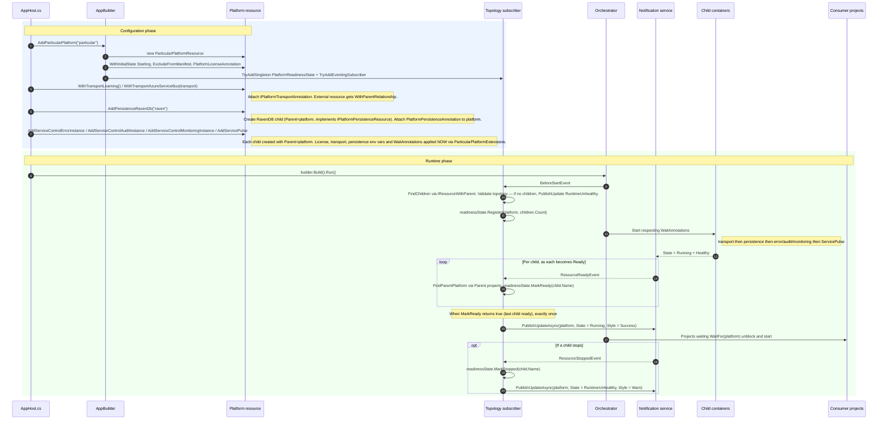

# Particular.Aspire.ServicePlatform — Platform Design

How `AddParticularPlatform(...)` works end-to-end, from the fluent API call in `AppHost.cs` through configuration, orchestrator startup, and child-readiness propagation to the `Running` state.

## Resource topology

```mermaid
graph TB
    Platform[ParticularPlatformResource<br/><i>synthetic, ExcludeFromManifest</i>]
    Transport[Transport<br/><i>external connection string</i>]
    Raven[RavenDbPlatformPersistenceResource<br/><i>implements IPlatformPersistenceResource</i>]
    Error[ServiceControlErrorInstanceResource]
    Audit[ServiceControlAuditInstanceResource]
    Monitoring[ServiceControlMonitoringInstanceResource]
    SP[ServicePulseResource]

    Platform -. WithParentRelationship .-> Transport
    Platform ==> Raven
    Platform ==> Error
    Platform ==> Audit
    Platform ==> Monitoring
    Platform ==> SP

    Platform -.- A1["IPlatformTransportAnnotation\n(LearningTransportAnnotation or\nAzureServiceBusTransportAnnotation)"]
    Platform -.- A2[PlatformPersistenceAnnotation]
    Platform -.- A3[PlatformLicenseAnnotation]

    classDef annotation fill:#fff3cd,stroke:#d4a600,stroke-dasharray: 3 3,color:#333
    classDef external fill:#e8e8e8,stroke:#888,stroke-dasharray: 5 5,color:#333
    classDef synthetic fill:#cfe2ff,stroke:#0d6efd,color:#333
    class A1,A2,A3 annotation
    class Transport external
    class Platform synthetic
```

The synthetic parent [`ParticularPlatformResource`](https://github.com/Particular/Particular.Aspire.Hosting.ServicePlatform/blob/main/src/Particular.Aspire.Hosting.ServicePlatform/Platform/ParticularPlatformResource.cs) holds no child references — the subscriber discovers children at runtime via `IResourceWithParent<ParticularPlatformResource>`. Transport is an external resource attached by annotation. Persistence (RavenDB, in the current implementation) is attached as a typed child resource implementing a marker interface. ServiceControl and ServicePulse resources are attached as children and discovered by their concrete resource type.



Legend: `==>` = typed child (`IResourceWithParent<T>` + lifecycle coupling), `-.->` = visual-only parent-relationship annotation, dashed boxes = annotations carrying config data.

## Discovery patterns

At `BeforeStartEvent`, all child resources of the platform are discovered via `IResourceWithParent<ParticularPlatformResource>`. The subscriber validates topology (marking the platform unhealthy if no children are present), then registers the child count in `PlatformReadinessState`.

At `ResourceReadyEvent`, if a platform child is the last one to become ready, the platform state changes to `Running`.

At `ResourceStoppedEvent`, if a platform child stops, the platform's state changes to `RuntimeUnhealthy`.

> See [Aspire Custom Integration Guide — Resource type design](aspire-integration-guide.md#resource-type-design) and [Synthetic parent resources](aspire-integration-guide.md#synthetic-parent-resources) for best practices on keeping resource classes and annotation shapes minimal, and for the rationale behind synthetic grouping nodes like `ParticularPlatformResource`.

### Annotations — for external references

Used for: [`IPlatformTransportAnnotation`](https://github.com/Particular/Particular.Aspire.Hosting.ServicePlatform/blob/main/src/Particular.Aspire.Hosting.ServicePlatform/Transport/IPlatformTransportAnnotation.cs), [`PlatformLicenseAnnotation`](https://github.com/Particular/Particular.Aspire.Hosting.ServicePlatform/blob/main/src/Particular.Aspire.Hosting.ServicePlatform/Licensing/PlatformLicenseAnnotation.cs), [`PlatformPersistenceAnnotation`](https://github.com/Particular/Particular.Aspire.Hosting.ServicePlatform/blob/main/src/Particular.Aspire.Hosting.ServicePlatform/Persistence/PlatformPersistenceAnnotation.cs).

Annotations attached to the platform resource hold references to configuration or resources that exist outside the child tree:

- **Transport** — consumer-supplied (such as `builder.AddConnectionString("transport")`, `builder.AddAzureServiceBus(...)`, etc.). The integration doesn't own or extend those resource types; instead, a new annotation type (such as `AzureServiceBusTransportAnnotation`) is authored as needed. Each new transport integration gets its own annotation, but that annotation should stay minimal — only fields intrinsic to the transport itself (e.g., `TransportType`, `ConnectionSource`). Configuration that describes how a *specific component* uses the transport (e.g., the SC error instance's throughput-reporting credentials for ASB) belongs on the component as an opt-in extension, not on the transport annotation. See [Opt-in extensions on child resources](#opt-in-extensions-on-child-resources) below.
- **License parameter** — a plain `ParameterResource`, not a platform child, held in `PlatformLicenseAnnotation`. Default value has an auto-discovery search path.
- **Persistence reference** — `PlatformPersistenceAnnotation` is attached by `WithPersistence<T>()` to record which persistence resource the platform uses. It holds a reference to the `IPlatformPersistenceResource`.

> **Key Design:** When supporting a new transport (or persistence) integration, **do not subclass or extend existing annotation/resource types**. Instead, create a new annotation class for the integration, with any additional fields needed. This ensures configuration boundaries and extensibility, without growing or tightly coupling the platform's core annotations.

> See [Anti-patterns to avoid](aspire-integration-guide.md#anti-patterns-to-avoid) and [Mental model](aspire-integration-guide.md#mental-model) in the Aspire Custom Integration Guide for a full list of architectural anti-patterns (including annotation misuse) and the reasoning behind treating resources as a discriminated union of annotations.

### Typed children — for platform-owned resources with fixed identity

Used for: [`ServiceControlErrorInstanceResource`](https://github.com/Particular/Particular.Aspire.Hosting.ServicePlatform/blob/main/src/Particular.Aspire.Hosting.ServicePlatform/Platform/ServiceControlErrorInstanceResource.cs), [`ServiceControlAuditInstanceResource`](https://github.com/Particular/Particular.Aspire.Hosting.ServicePlatform/blob/main/src/Particular.Aspire.Hosting.ServicePlatform/Platform/ServiceControlAuditInstanceResource.cs), [`ServiceControlMonitoringInstanceResource`](https://github.com/Particular/Particular.Aspire.Hosting.ServicePlatform/blob/main/src/Particular.Aspire.Hosting.ServicePlatform/Platform/ServiceControlMonitoringInstanceResource.cs), [`ServicePulseResource`](https://github.com/Particular/Particular.Aspire.Hosting.ServicePlatform/blob/main/src/Particular.Aspire.Hosting.ServicePlatform/Platform/ServicePulseResource.cs).

Each of these is owned by the platform and has a single, fixed role. All implement [`IPlatformComponent`](https://github.com/Particular/Particular.Aspire.Hosting.ServicePlatform/blob/main/src/Particular.Aspire.Hosting.ServicePlatform/Platform/IPlatformComponent.cs) and `IResourceWithParent<ParticularPlatformResource>`. The subscriber finds them by class type, e.g.:

```csharp
var errorInstance = children.OfType<ServiceControlErrorInstanceResource>().SingleOrDefault();
```

No annotation is needed — the concrete type *is* the identity. `IResourceWithParent<ParticularPlatformResource>` on each resource supplies both the discovery path and lifecycle coupling.

### Marker interface — for platform-owned resources with multiple implementations

Used for: [`IPlatformPersistenceResource`](https://github.com/Particular/Particular.Aspire.Hosting.ServicePlatform/blob/main/src/Particular.Aspire.Hosting.ServicePlatform/Persistence/IPlatformPersistenceResource.cs) (currently: `RavenDbPlatformPersistenceResource`; e.g., future SQL Server).

Persistence is detected and consumed via a marker interface, which includes discovery and connection configuration:

```csharp
public interface IPlatformPersistenceResource : IResourceWithParent<ParticularPlatformResource> {
    string PersistenceType { get; }                          // "RavenDB", "SqlServer", ...
    ReferenceExpression ConnectionStringExpression { get; }
    string ConnectionStringEnvironmentVariableName { get; }  // "RAVENDB_CONNECTIONSTRING", ...
}
```

When adding a new persistence implementation (e.g., SQL Server):
- Create a new resource type (e.g., `SqlPlatformPersistenceResource`) implementing `IPlatformPersistenceResource`.
- Create a new annotation type (e.g., `SqlServerPlatformPersistenceAnnotation`) for custom needs; **do not extend existing annotations**.
- Attach via annotation, not by subclassing existing ones.

### Additional annotations on child resources

- [`RemoteInstanceAnnotation`](https://github.com/Particular/Particular.Aspire.Hosting.ServicePlatform/blob/main/src/Particular.Aspire.Hosting.ServicePlatform/Platform/RemoteInstanceAnnotation.cs) — lets error instances point to remote audit.
- [`ThroughputQueueAnnotation`](https://github.com/Particular/Particular.Aspire.Hosting.ServicePlatform/blob/main/src/Particular.Aspire.Hosting.ServicePlatform/Platform/ThroughputQueueAnnotation.cs) — for metrics queue between error/monitoring and ServicePulse.
- [`ThroughputReportingAnnotation`](https://github.com/Particular/Particular.Aspire.Hosting.ServicePlatform/blob/main/src/Particular.Aspire.hosting.ServicePlatform/ThroughputReporting/ThroughputReportingAnnotation.cs) — marker annotation attached to an error instance when throughput reporting is configured. Carries the `IThroughputReportingProvider` (e.g., `AzureServiceBusThroughputReporting`, which holds the service-bus name, tenant/subscription/client IDs, client secret, and optional management URL used by the SC error instance's licensing component to query ASB metrics).

### Opt-in extensions on child resources

Some component configuration is genuinely optional (the user opts in by chaining a `With...` method on the child builder). The convention follows three pieces:

1. **A data-carrying annotation** (e.g., `ThroughputQueueAnnotation` in `Particular.Aspire.ServicePlatform.Platform` directly owns the queue name). For pluggable opt-ins, the annotation is a thin marker that carries the provider instance (e.g., `ThroughputReportingAnnotation` in `Particular.Aspire.ServicePlatform.ThroughputReporting` holds an `IThroughputReportingProvider`); the provider owns the values, and the env vars are the projection.
2. **`internal const string` env-var names** on the consuming class (e.g., `ServiceControlErrorInstanceResource.ThroughputQueueEnvVar` for SC-contract envs that are always applied; `AzureServiceBusThroughputReporting.ServiceBusNameEnvVar` for envs scoped to a specific opt-in provider). Centralises each env-var contract in one place.
3. **An extension method** on `IResourceBuilder<TComponent>` in the appropriate `…Extensions.cs` file (e.g., `ErrorInstanceExtensions.WithThroughputReporting`). For pluggable opt-ins like throughput reporting it accepts a provider interface (`IThroughputReportingProvider`); the provider validates inputs and projects the values as env vars via its own consts, while the extension method attaches the marker annotation so the wire-up is introspectable.

This shape lets cross-resource consumers read the values back via `TryGetLastAnnotation<T>(...)`. For example, `MonitoringInstanceExtensions.WithThroughputQueueFrom(errorInstance)` reads `ThroughputQueueAnnotation` off the error instance to copy the queue name onto monitoring without forcing the caller to repeat it. New opt-in extensions should mirror the pattern so the same consumer-side reuse stays available.

### Adding new transports or persistence types

**Do not extend or subclass base platform annotation/resource types for new integrations.**

Instead, follow this process:
1. Create a new annotation type (e.g., `FooTransportAnnotation`, `BarPersistenceAnnotation`) for the new integration, including any extra configuration required by that transport or persistence provider. Attach with `.WithAnnotation(...)`.
2. If a new resource is needed, define a new resource type implementing the appropriate interface (`IResourceWithParent<ParticularPlatformResource>` or `IPlatformPersistenceResource`).
3. Connect with `WithParentRelationship` and annotate, without altering base classes.
4. Consumers discover all platform integrations by reading all attached annotation types for transport and persistence; new annotations are automatically discovered if they implement the correct marker interfaces.

**Each integration remains isolated, versionable, and avoids breaking existing integrations.**

## Lifecycle sequence



## Key invariants

- **Platform resource has no mutable state.** Config lives on annotations (`IPlatformTransportAnnotation`, `PlatformLicenseAnnotation`, `PlatformPersistenceAnnotation`) attached at configuration time.
- **No subclassing of base platform annotation/resource types for extensions.** New transport/persistence integrations are added with new annotation types containing only the relevant fields.
- **Cross-wiring happens at configuration time, order-independently.** via `With*` fluent methods (`ParticularPlatformExtensions`).
- **Platform readiness ↔ all children ready.** Readiness tracked by [`PlatformReadinessState`](https://github.com/Particular/Particular.Aspire.Hosting.ServicePlatform/blob/main/src/Particular.Aspire.Hosting.ServicePlatform/Platform/PlatformReadinessState.cs).
- **Missing transport is detected at configuration time.** `ParticularPlatformResource.GetTransport()` throws if absent.
- **No children → unhealthy state.** Marked by eventing subscriber at runtime.
- **Children die with platform.** Strong lifecycle coupling via `IResourceWithParent<ParticularPlatformResource>`.

> For broader Aspire integration principles — project layout, naming conventions, lifecycle patterns, and connection string design — consult the [Aspire Custom Integration Guide](aspire-integration-guide.md).

## Extension API usage example

```csharp
// AppHost.cs
var transport = builder.AddConnectionString("transport"); // or builder.AddAzureServiceBus("transport")

var platform = builder.AddParticularPlatform("platform")
    .WithTransportAzureServiceBus(transport); // or .WithTransportLearning()

var persistence = platform.AddPersistenceRavenDb("ravendb");

var error = platform.AddServiceControlErrorInstance("servicecontrol", persistence)
    .WithThroughputQueue("particular.throughput")
    .WithThroughputReporting(new AzureServiceBusThroughputReporting(  // opt-in: SC reports ASB throughput
        serviceBusName:  builder.AddParameter("asb-service-bus-name"),
        tenantId:        builder.AddParameter("asb-tenant-id"),
        subscriptionId:  builder.AddParameter("asb-subscription-id"),
        clientId:        builder.AddParameter("asb-client-id"),
        clientSecret:    builder.AddParameter("asb-client-secret", secret: true)));

var audit = platform.AddServiceControlAuditInstance("servicecontrol-audit", error, persistence);
var monitoring = platform.AddServiceControlMonitoringInstance("servicecontrol-monitoring")
    .WithThroughputQueueFrom(error);                   // copies the throughput queue name from error
platform.AddServicePulse("servicepulse", error, monitoring);

// Optionally inject license + transport into a consumer project:
builder.AddProject<Projects.MyWorker>("worker")
    .WithParticularPlatform(platform);
```

License configuration options (all on `IResourceBuilder<ParticularPlatformResource>`):
- `.WithLicenseFromFile("license.xml")` — reads from a specific file path.
- `.WithLicenseFromText(licenseXml)` — inlines the license XML.
- Default (`ServicePlatformDefaultLicense`): auto-discovers from `%PROGRAMDATA%/ParticularSoftware/license.xml`, `%LOCALAPPDATA%/ParticularSoftware/license.xml`, or the `PARTICULARSOFTWARE_LICENSE` env var.

## Env vars applied to each child (at configuration time)

| Target       | License                        | Transport                              | Persistence                  | Remote instances              | ServicePulse URLs                                             |
| ------------ | ------------------------------ | -------------------------------------- | ---------------------------- | ----------------------------- | ------------------------------------------------------------- |
| Error        | ✅ `PARTICULARSOFTWARE_LICENSE` | ✅ `TRANSPORTTYPE` + `CONNECTIONSTRING` | ✅ `RAVENDB_CONNECTIONSTRING` | ✅ `REMOTEINSTANCES` (→ audit) | —                                                             |
| Audit        | ✅                              | ✅                                      | ✅                            | —                             | —                                                             |
| Monitoring   | ✅                              | ✅                                      | —                            | —                             | —                                                             |
| ServicePulse | ✅                              | —                                      | —                            | —                             | ✅ `SERVICECONTROL_URL` (→ error) + `MONITORING_URL` (→ monitoring) |
| RavenDB      | —                              | —                                      | —                            | —                             | —                                                             |

The Error instance can additionally receive opt-in env vars from caller-chained extensions:
- `WithThroughputQueue(name)` → `LICENSINGCOMPONENT_SERVICECONTROLTHROUGHPUTDATAQUEUE`
- `WithThroughputReporting(new AzureServiceBusThroughputReporting(serviceBusName, tenantId, subscriptionId, clientId, clientSecret, managementUrl?))` → `LICENSINGCOMPONENT_ASB_SERVICEBUSNAME` + `..._TENANTID` + `..._SUBSCRIPTIONID` + `..._CLIENTID` + `..._CLIENTSECRET` (and `..._MANAGEMENTURL` when the optional argument is supplied)

Wait dependencies mirror the always-applied relationships: error waits for transport + persistence; audit waits for persistence; ServicePulse waits for error + monitoring; etc. Opt-in extensions add env vars but no wait dependencies.

## See Also

- [**Aspire Custom Integration Guide**](aspire-integration-guide.md) — best practices, anti-patterns, mental model, and implementation patterns for building Aspire integrations (recommended reading for anyone extending this platform)

